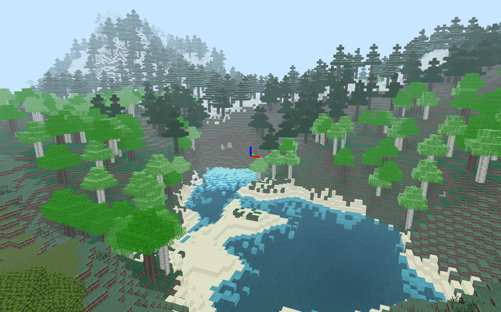
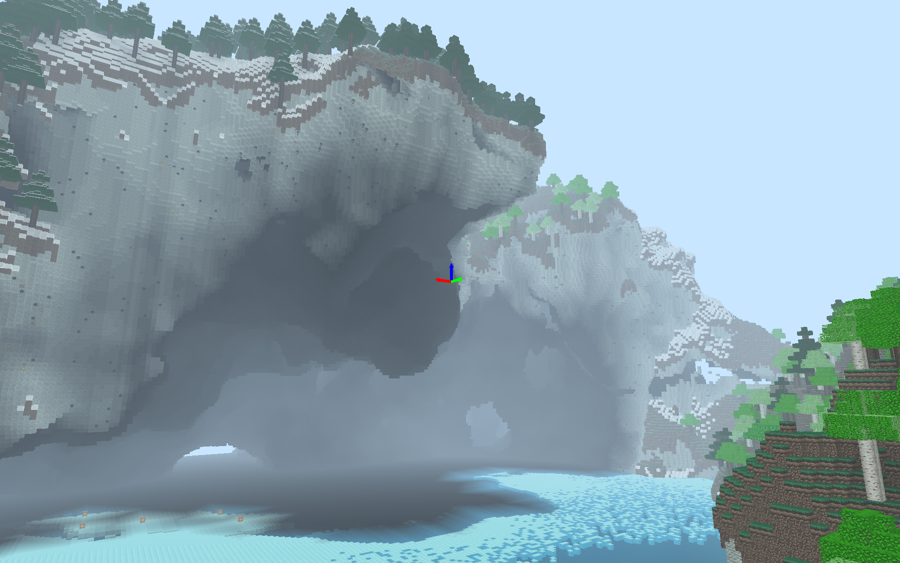
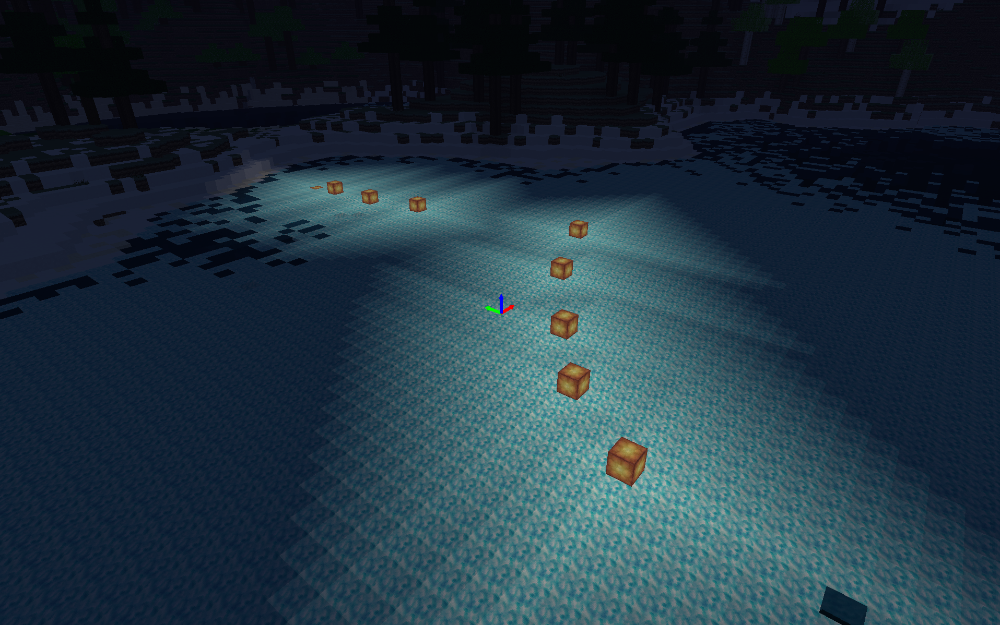
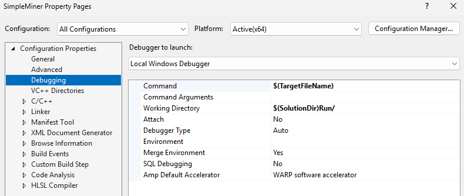

# Simple Miner

<p align="center">
  
</p>

<p align="center">
  <strong>Custom C++ Engine | DirectX 11 | Procedural Voxel World</strong>
</p>

## Overview

Simple Miner is a Minecraft-inspired voxel sandbox built entirely within my custom C++ game engine.

The project features procedural terrain generation, multithreaded chunk streaming, voxel lighting, fluid simulation, and real-time terrain destruction. The world is generated dynamically around the player, enabling large-scale exploration while maintaining predictable CPU and memory usage.

## Technical Deep Dive

For a detailed breakdown of the procedural generation systems, chunk streaming architecture, voxel lighting, fluid simulation, cave generation, and world-building techniques used in this project, visit the full project page:

**https://www.macraesmith.com/projects/simple-miner**

---

## Technologies

* C++
* DirectX 11
* HLSL
* Custom Game Engine
* Multi-Threaded Job System
* Procedural Generation
* Voxel Rendering

---

## Key Features

### Procedural Voxel World

* Infinite chunk-based terrain streaming
* Configurable render distance
* Multithreaded world generation

### Advanced Terrain Generation

* Layered Perlin, Fractal, Ridged, and Domain-Warped noise
* Climate-driven biome distribution
* Procedural vegetation placement
* Large-scale cave networks

### Dynamic World Simulation

* Flood-fill voxel lighting
* Water and lava simulation
* Real-time terrain destruction
* TNT chain reactions and physics interactions

### Player Systems

* First-person exploration
* Block interaction and editing
* Physics-based movement

---

## Screenshots

<p align="center">
  
</p>

<p align="center">
  
</p>

---

## Controls

### General

| Key | Action |
|------|------|
| Space | Start Game |
| Esc | Exit / Quit |
| P | Pause |
| O | Step One Frame |
| T | Slow Mode |

### Movement

| Key | Action |
|------|------|
| Mouse | Look Around |
| WASD | Move |
| Q / E | Move Up / Down |

### World Interaction

| Key | Action |
|------|------|
| Left Mouse Button | Remove Block |
| Right Mouse Button | Add Block |
| R | Lock Player Raycast |

### Debug

| Key | Action |
|------|------|
| F1 | Show Performance Statistics |
| F2 | Toggle Chunk Bounds |
| F3 | Debug Job System |
| F4 | Toggle Chunk Loading |
| F8 | Reset World |

### Modes

| Key | Action |
|------|------|
| C | Change Camera Mode |
| V | Change Physics Mode |

---

## Running the Project

### Launch Prebuilt Executable

```text
SimpleMiner/Run/SimpleMiner_Release_x64.exe
```

### Build From Source

1. Open `SimpleMiner/SimpleMiner.sln` in Visual Studio 2022.

2. Configure the debugger settings:

   * Right-click the **SimpleMiner** project and select **Properties**
   * Navigate to **Configuration Properties > Debugging**
   * Set:

   ```text
   Command:            $(TargetFileName)
   Working Directory:  $(SolutionDir)Run/
   ```
     <p align="center">
      
    </p>

3. Build the solution:

   ```text
   Ctrl + Shift + B
   ```

4. Run the project:

   ```text
   F5
   ```

Recommended build configurations:

* Release
* Fast_Break


